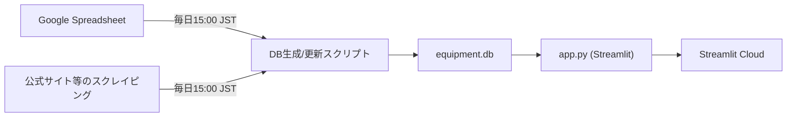

# 龍オン装備検索（Ryuon Equipment Search）

装備の一覧表示・検索・絞り込みのためのツール（Streamlit アプリ）です。  
公開URL： https://apricot-ryuon-equipment.streamlit.app/

---

## 閲覧者向け（使い方）
- 装備一覧の閲覧
- 条件で検索 / フィルタ
- （必要なら）ステータス合算 など

👉 まずは上のURLから利用してください。

---

## 開発者/運用者向け（このリポジトリの役割）
このリポジトリは Streamlit アプリ（上記URL）のバックエンドとして動作します。

- `app.py` は `equipment.db` を参照して表示を行います
- `equipment.db` は **毎日15:00（日本時間）** に更新されます
  - データ元：Google Spreadsheet + スクレイピング
  - 更新は GitHub Actions により自動実行され、更新結果（成功/失敗）は Actions の実行履歴で確認できます

---

## 自動更新（GitHub Actions）
ワークフロー：`.github/workflows/reload-db.yml`

- 実行方法
  - 定期実行：毎日 15:00 JST（cron: 0 6 * * * / UTC）
  - 手動実行：workflow_dispatch

- 処理の流れ（概要）
  1. Sheets → DB 反映（`reload_ss_to_db.py`）
  2. スクレイピング（`scraping_equipment.py`）
  3. 画像の BASE64 化 + DB 更新（`trans_base64.py`）
  4. インデックス削除など整形（`index_drop_db.py`）
  5. `equipment.db` と `static/` をコミットして push


## 仕組み（データフロー）

---

## 必要な Secrets（GitHub Actions）
以下は **GitHub Actions の Secrets** として設定してください（値は README に書かない）。

| Name | 用途 |
|---|---|
| SPREADSHEET_KEY_NAME | 参照する Google Spreadsheet のキー（識別子） |
| GCP_TYPE | service_account |
| GCP_PROJECT_ID | GCP プロジェクトID |
| GCP_PRIVATE_KEY_ID | サービスアカウント鍵ID |
| GCP_PRIVATE_KEY | サービスアカウント秘密鍵（改行含むので取り扱い注意） |
| GCP_CLIENT_EMAIL | サービスアカウントEmail |
| GCP_CLIENT_ID | サービスアカウントClient ID |
| GCP_AUTH_URI | 認証URI |
| GCP_TOKEN_URI | トークンURI |
| GCP_AUTH_PROVIDER_CERT_URL | 証明書URL |
| GCP_CLIENT_CERT_URL | クライアント証明書URL |
| GCP_UNIVERSE_DOMAIN | googleapis.com など |

補足：
- `NOW_BRANCH` は workflow 実行時のブランチ名が自動で渡されます。

---

## ローカル起動（開発）
```bash
python -m venv .venv
source .venv/bin/activate  # Windows は .venv\Scripts\activate
pip install -r requirements.txt
streamlit run app.py
```
---
## 主要ファイル
- app.py：Streamlit アプリ本体（DB参照して表示）
- equipment.db：アプリが参照する SQLite DB（Actions で更新）
- reload_ss_to_db.py：Sheets → DB 反映
- scraping_equipment.py：装備情報のスクレイピング
- trans_base64.py：画像を BASE64 化して DB 更新
- index_drop_db.py：DB のインデックス調整
- static/：画像などの静的ファイル

---
