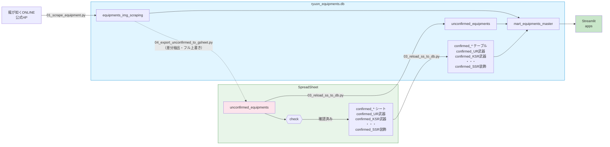

# 龍オン装備検索（Ryuon Equipment Search）

装備の一覧表示・検索・絞り込みのためのツール（Streamlit アプリ）です。  
公開URL： https://apricot-ryuon-equipment.streamlit.app/

---

## 閲覧者向け（使い方）
- 装備一覧の閲覧
- 条件で検索 / フィルタ
- （必要なら）ステータス合算 など

👉 まずは上のURLから利用してください。

---

## 開発者/運用者向け（このリポジトリの役割）
このリポジトリは Streamlit アプリ（上記URL）のバックエンドとして動作します。

- `app.py` は `ryuon_equipments.db` を参照して表示を行います
- `ryuon_equipments.db` は **毎日14:13（日本時間）** に更新されます
  - データ元：Google Spreadsheet + スクレイピング
  - 更新は GitHub Actions により自動実行され、更新結果（成功/失敗）は Actions の実行履歴で確認できます

---

## 自動更新（GitHub Actions）
ワークフロー：`.github/workflows/reload-db.yml`

- 実行方法
  - 定期実行：毎日 14:13 JST（cron: 13 5 * * * / UTC）
  - 手動実行：workflow_dispatch

- 処理の流れ（概要）
  1. スクレイピング（`01_scrape_equipment.py`）
     - 公式サイトから最新20件の装備情報を取得
     - `equipments_img_scraping` テーブルに保存
  2. 重複レコードの削除（`02_index_drop_db.py`）
     - `equipments_img_scraping` を（装備名, レアリティ）単位で重複削除
  3. Sheets → DB 反映（`03_reload_ss_to_db.py`）
     - `confirmed_*` シート（confirmed_UR武器 / confirmed_KSR武器 / confirmed_SSR武器 / confirmed_UR防具 / ... 計9シート）を読み込み
     - `unconfirmed_equipments` シートを読み込み
     - `confirmed_*` に存在する装備を `unconfirmed_equipments` から自動削除（DB・SS両方）
  4. 未確認装備のスプレッドシート更新（`04_export_unconfirmed_to_gsheet.py`）
     - `equipments_img_scraping` から `confirmed_*` テーブルの差分を抽出
     - 画像のMSE比較で装備種類（武器/防具/装飾）を自動判定
     - アビリティテキストからアビリティカテゴリを推測
     - `装備番号` を生成（例: `0_4_1_001`）
     - `unconfirmed_equipments` シートをフル上書き（`DESIRED_COLUMNS` 順）
  5. マスターテーブル作成（`05_create_mart_master.py`）
     - `confirmed_*` テーブル（9件）＋ `unconfirmed_equipments` → `mart_equipments_master` 作成
  6. ログ更新（`06_update_load_log.py`）
  7. データベース最適化（`07_vacuum_db.py`）
  8. 装備評価生成（`generate-evaluations.yml` ワークフローで自動実行）
     - 最新10件の装備の評価HTML・PNGを生成
  9. `ryuon_equipments.db`、`load_log.csv`、`static/`、`evaluation_sheets/` をコミットして push


## 仕組み（データフロー）

```mermaid
flowchart LR
  Web["龍が如くONLINE\n公式HP"]

  subgraph SS["SpreadSheet"]
    direction TB
    SSUnconfirmed["unconfirmed_equipments"]
    Check{{"check"}}
    SSConfirmed["confirmed_* シート\nconfirmed_UR武器\nconfirmed_KSR武器\n・・・\nconfirmed_SSR装飾"]
    SSUnconfirmed --> Check
    Check -->|"確認済み"| SSConfirmed
  end

  subgraph DB["ryuon_equipments.db"]
    direction TB
    ImgScraping["equipments_img_scraping"]
    UnconfirmedDB["unconfirmed_equipments"]
    ConfirmedTables["confirmed_* テーブル\nconfirmed_UR武器\nconfirmed_KSR武器\n・・・\nconfirmed_SSR装飾"]
    Mart["mart_equipments_master"]
    ImgScraping --> Mart
    UnconfirmedDB --> Mart
    ConfirmedTables --> Mart
  end

  App["Streamlit\napps"]

  Web -->|"01_scrape_equipment.py"| ImgScraping
  ImgScraping -.->|"04_export_unconfirmed_to_gsheet.py\n（差分抽出・フル上書き）"| SSUnconfirmed
  SSUnconfirmed -->|"03_reload_ss_to_db.py"| UnconfirmedDB
  SSConfirmed -->|"03_reload_ss_to_db.py"| ConfirmedTables
  Mart --> App

  style SS fill:#e8f5e9,stroke:#388e3c
  style DB fill:#e1f5ff,stroke:#0288d1
  style SSUnconfirmed fill:#fce4ec
  style App fill:#c8e6c9
```

### データフローの説明
1. **スクレイピング**: 公式サイトから最新20件の装備情報と画像を取得（`equipments_img_scraping`）
2. **重複削除**: スクレイピングデータから（装備名, レアリティ）単位で重複を除去
3. **Sheets → DB**: `confirmed_*` シート（9件）＋ `unconfirmed_equipments`（SS上で手動修正済み）をDBに反映。`confirmed_*` に存在する装備は `unconfirmed_equipments` から自動削除
4. **未確認抽出・自動判定**: `equipments_img_scraping` から `confirmed_*` の差分を抽出し、装備種類・アビリティカテゴリ・装備番号を自動付与して `unconfirmed_equipments` シート（SS）をフル上書き
5. **マスター作成**: `confirmed_*`（9テーブル）＋ `unconfirmed_equipments` → `mart_equipments_master` に統合
6. **装備評価生成**: 最新10件の装備の評価HTML・PNGを自動生成
7. **アプリ表示**: `mart_equipments_master` と `equipments_img_scraping` を結合して表示

> **unconfirmed_equipments の修正フロー**  
> スプレッドシート上の `unconfirmed_equipments` シートでアビリティカテゴリ等を手動修正すると、翌日のGHA実行時（手順3）にDBへ反映されます。  
> 確認済みとなった装備は `confirmed_*` シートへ移動してください。翌日の実行時に `unconfirmed_equipments` から自動削除されます。

---

## 装備番号体系

`装備番号` は `{装備種類}_{レアリティ}_{確認状態}_{連番}` の形式です。

| セグメント | 値 | 意味 |
|---|---|---|
| 装備種類 | 0 | 武器 |
| 装備種類 | 1 | 防具 |
| 装備種類 | 2 | 装飾 |
| レアリティ | 3 | LR |
| レアリティ | 4 | UR |
| レアリティ | 5 | KSR |
| レアリティ | 6 | SSR |
| 確認状態 | 0 | confirmed（確認済み） |
| 確認状態 | 1 | unconfirmed（未確認） |

例: `0_4_0_001` = 武器 / UR / 確認済み / 001番目

---

## 装備評価生成システム

### 概要
装備のステータスとアビリティを自動評価し、HTML・PNG形式で出力するシステムです。  
GitHub Actionsで毎日自動実行され、`evaluation_sheets/`ディレクトリに保存されます。

### 自動生成ワークフロー
ワークフロー：`.github/workflows/generate-evaluations.yml`

- 実行タイミング
  - `reload-db.yml`完了後に自動実行（workflow_run）
  - 手動実行：workflow_dispatch

- 処理内容
  - URL_Numberが最も大きい上位10件の装備を取得（`equipments_img_scraping` ベース）
  - 既存ファイルはスキップ（日付無視のパターンマッチ）
  - 各装備の評価HTML・PNG画像を生成
  - ファイル名形式：`yyyymmdd_{URL_Number}_{装備名}_{レアリティ}_評価.html`

### 評価基準

#### 1. ステータス評価
同装備種類内での各ステータスのランキングを計算し、スコア化します。

**スコア計算式**：
- 1位 = 100点
- 最下位 = 50点
- その間は線形補間

**評価方法**：
- **同装備種類内評価**: 武器は武器内、防具は防具内でランキング
- **型内評価**: 特定のステータス組み合わせ（例：体力+攻撃力）でランキング
- 最終スコアは両評価の高い方を採用

**型分類**：
- **体力特化型**: 体力が最高スコア
- **攻撃型**: 攻撃力が最高スコア
- **防御型**: 防御力が最高スコア
- **会心型**: 会心率が最高スコア
- **バランス型**: 2種以上のステータスが高スコア（60点以上）

#### 2. アビリティ評価
アビリティカテゴリ重要度・発動条件倍率・効果量スコアを総合して算出します。

**スコア計算式**：
```
アビリティスコア = (アビリティカテゴリ重要度 + 効果量スコア) × 発動倍率 × 0.5
```

**複数カテゴリ時の扱い**：
- 代表値は「アビリティカテゴリ重要度の最大値」を採用
- 効果量スコアも代表カテゴリに対応する値を採用

**カテゴリ重要度**：
- `config/ability_category_settings.csv` で管理（0〜100）
- 例: `BSCT加速=100`, `不死=90`, `ダメージカット=80`, `体力上昇=60`, `資金獲得量上昇=0`

**新しいアビリティカテゴリ追加時のワークフロー**：
1. `config/ability_category_settings.csv` に新カテゴリの行を追加（最低限: `カテゴリ`, `重要度`）
2. 必要に応じて `効果係数` を設定（未設定時は既定値 `1.0`）
3. ローカル確認を実行
  - `python generate_equipment_evaluation.py "装備名" "レアリティ"`
4. martスコアDBを再生成
  - `python generate_equipment_mart_score_db.py`
5. 差分確認（評価HTML / martスコア / READMEなど）後にコミット

補足:
- CSV未登録カテゴリは既定値で評価されます（重要度 `60`、効果係数 `1.0`）
- 互換のため、`config/ability_category_settings.csv` がない場合のみ旧パス `mock_評価/ability_category_settings.csv` を参照します

**発動倍率（主なルール）**：
- 常時発動 / バトル開始時 / ドンパチ・タイマン時: `1.00`
- HP条件（以上）: `n<50 → 1.00`, `n=50 → 0.95`, `n>50 → 0.90`
- HP条件（以下）: `0.50`
- ヒートゲージ条件: `0.50`
- 通常攻撃時: `1 - 1/p`（`p` は発動確率%）
- 攻撃時: `1.00`
- 状態異常時: 相手なら `1.00`、自身なら `0.50`
- 特性保有者2〜3人条件: 主要特性（組長/東条会/街の住人/水商売）かつ味方参照 `0.95`、その他 `0.70`
- 敵生存者**人以上: `0.80` / 味方生存**人以上: `1.00`

**効果量スコア**：
- 効果量 `e` を抽出し、同じ「装備種類×カテゴリ」内で min-max 正規化
- 式: `100 × (e - min_e) / (max_e - min_e)`
- 人数依存（例: 敵/味方人数×6%）は定義人数で展開（生存5人、不在4人）

**効果量の例外**：
- `神田のスーツ_SSR`: 効果量 `25` を採用
- `状態異常付与`:
  - 魅了/封印/混乱/麻痺/回復不可/失神: `基礎値 + 5×秒数`
  - 出血: `90 + %`
  - 打撲: `80 + ダメージ/1000`
  - 骨折: `50 + ダメージ/1000 + 2×秒数`
  - 拘束: `100`
- `特殊効果付与`:
  - ステータス上昇阻害/クールタイム阻害: `65 + 5×秒数`
  - その他: `100`
- `ダメージ無効化`: `80 + %`

**評価ランク**：
- 80点以上: 🌟 非常に優秀なアビリティ
- 60-79点: ⭐ 優秀なアビリティ
- 40-59点: ✨ 実用的なアビリティ
- 40点未満: 📝 状況次第で有用

#### 3. 上位互換装備の検出
以下の条件を満たす装備を上位互換として表示：
- 全ステータスが同等以上
- 装備種類が同じ
- アビリティスコアが同等以上

### 生成ファイル
- **HTMLファイル**: `evaluation_sheets/{yyyymmdd}_{URL_Number}_{装備名}_{レアリティ}_評価.html`
- **PNG画像**: `evaluation_sheets/images/{yyyymmdd}_{URL_Number}_{装備名}_{レアリティ}_評価.png`

### ローカルでの評価生成
```bash
# 特定装備の評価を生成
python generate_equipment_evaluation.py "装備名" "レアリティ"

# 最新10件の評価を生成（GitHub Action用）
python 01_generate_evaluations.py
```

---

## 必要な Secrets（GitHub Actions）
以下は **GitHub Actions の Secrets** として設定してください（値は README に書かない）。

| Name | 用途 |
|---|---|
| SPREADSHEET_KEY_NAME | 参照する Google Spreadsheet のキー（識別子） |
| GCP_TYPE | service_account |
| GCP_PROJECT_ID | GCP プロジェクトID |
| GCP_PRIVATE_KEY_ID | サービスアカウント鍵ID |
| GCP_PRIVATE_KEY | サービスアカウント秘密鍵（改行含むので取り扱い注意） |
| GCP_CLIENT_EMAIL | サービスアカウントEmail |
| GCP_CLIENT_ID | サービスアカウントClient ID |
| GCP_AUTH_URI | 認証URI |
| GCP_TOKEN_URI | トークンURI |
| GCP_AUTH_PROVIDER_CERT_URL | 証明書URL |
| GCP_CLIENT_CERT_URL | クライアント証明書URL |
| GCP_UNIVERSE_DOMAIN | googleapis.com など |

補足：
- `NOW_BRANCH` は workflow 実行時のブランチ名が自動で渡されます。

---

## ローカル起動（開発）

### 必要な環境
- Python 3.11（GitHub Actionsと同じバージョン推奨）

### セットアップ
```bash
# Python 3.11で仮想環境を作成
python3.11 -m venv myenv
source myenv/bin/activate  # Windows は myenv\Scripts\activate

# 依存パッケージをインストール
pip install -r requirements.txt

# アプリ起動
streamlit run app.py
```

### パイプラインのローカル実行
```bash
python 01_scrape_equipment.py
python 02_index_drop_db.py
python 03_reload_ss_to_db.py
python 04_export_unconfirmed_to_gsheet.py --no-write-db  # SSのみ更新
python 05_create_mart_master.py
python 06_update_load_log.py
python 07_vacuum_db.py
```

---

## 主要ファイル

### アプリケーション
- `app.py`：Streamlit アプリ本体（DB参照して表示）
- `ryuon_equipments.db`：アプリが参照する SQLite DB（Actions で更新）

### データ更新スクリプト（GHAパイプライン）
- `01_scrape_equipment.py`：装備情報のスクレイピング（最新20件）
- `02_index_drop_db.py`：重複装備レコードの削除・データクレンジング
- `03_reload_ss_to_db.py`：Google Sheets → DB 反映（`confirmed_*` 9シート＋`unconfirmed_equipments`）
- `04_export_unconfirmed_to_gsheet.py`：未確認装備を自動判定して `unconfirmed_equipments` シートをフル上書き
  - 画像MSE比較で装備種類を判定（参照画像：レアリティコード昇順で選択）
  - アビリティテキストからカテゴリを推測
- `05_create_mart_master.py`：全装備データを統合した `mart_equipments_master` 作成
- `06_update_load_log.py`：更新ログの記録（`load_log.csv`）
- `07_vacuum_db.py`：データベースの最適化（VACUUM）

### 装備評価生成スクリプト
- `generate_equipment_evaluation.py`：指定装備の評価HTML・PNG生成
- `01_generate_evaluations.py`：最新10件の装備評価を自動生成（GHA用）
- `ability_evaluator.py`：アビリティ評価ロジック
- `generate_equipment_mart_score_db.py`：装備評価スコアDBの生成

### その他
- `static/`：装備画像などの静的ファイル
- `evaluation_sheets/`：自動生成された装備評価HTML・PNG

---

## データベース構造

### 主要テーブル（`ryuon_equipments.db`）

- `mart_equipments_master`：全装備データの統合マスターテーブル
  - `confirmed_*` テーブル（9件）＋ `unconfirmed_equipments` を統合
  - 装備種類・アビリティカテゴリ・装備番号などを含む完全なデータ

- `equipments_img_scraping`：スクレイピングした装備データ
  - 画像URL・ステータス・アビリティを保持
  - 装備種類・アビリティカテゴリは含まない（後処理で判定）

- `unconfirmed_equipments`：未確認の装備データ
  - スクレイピングで取得したが、まだ `confirmed_*` に移動していない装備
  - 画像MSE比較とアビリティ推測で装備種類・カテゴリを自動付与
  - 手動確認後は `confirmed_*` シート（SS）に移動

- `confirmed_UR武器` / `confirmed_KSR武器` / `confirmed_SSR武器` /  
  `confirmed_UR防具` / `confirmed_KSR防具` / `confirmed_SSR防具` /  
  `confirmed_UR装飾` / `confirmed_KSR装飾` / `confirmed_SSR装飾`
  - Google Sheets `confirmed_*` シートから同期された確定済み装備データ

---
