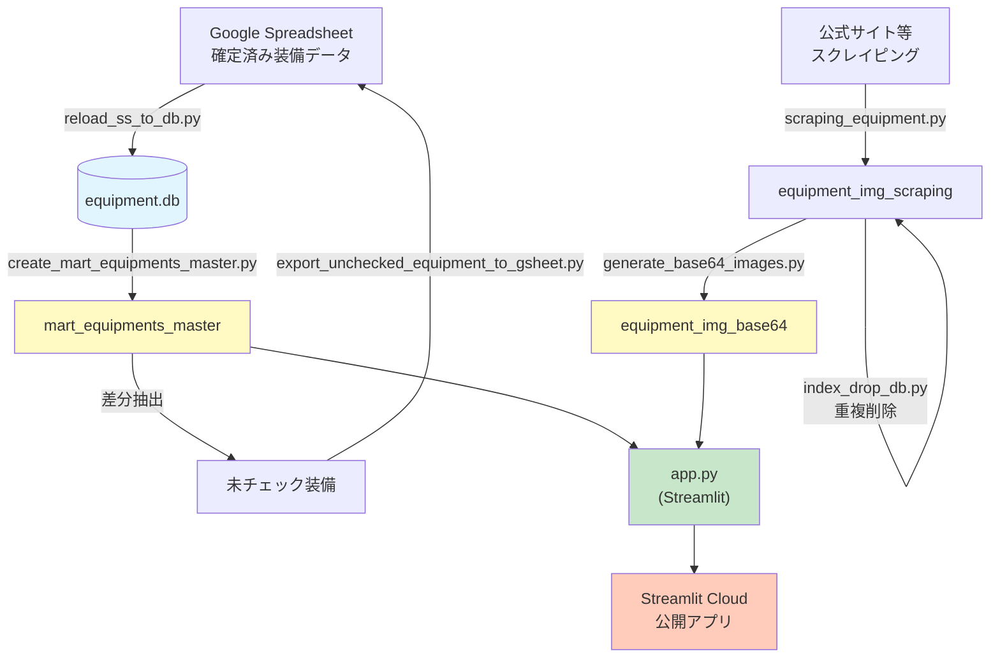

# 龍オン装備検索（Ryuon Equipment Search）

装備の一覧表示・検索・絞り込みのためのツール（Streamlit アプリ）です。  
公開URL： https://apricot-ryuon-equipment.streamlit.app/

---

## 閲覧者向け（使い方）
- 装備一覧の閲覧
- 条件で検索 / フィルタ
- （必要なら）ステータス合算 など

👉 まずは上のURLから利用してください。

---

## 開発者/運用者向け（このリポジトリの役割）
このリポジトリは Streamlit アプリ（上記URL）のバックエンドとして動作します。

- `app.py` は `equipment.db` を参照して表示を行います
- `equipment.db` は **毎日15:00（日本時間）** に更新されます
  - データ元：Google Spreadsheet + スクレイピング
  - 更新は GitHub Actions により自動実行され、更新結果（成功/失敗）は Actions の実行履歴で確認できます

---

## 自動更新（GitHub Actions）
ワークフロー：`.github/workflows/reload-db.yml`

- 実行方法
  - 定期実行：毎日 15:00 JST（cron: 0 6 * * * / UTC）
  - 手動実行：workflow_dispatch

- 処理の流れ（概要）
  1. Sheets → DB 反映（`reload_ss_to_db.py`）
     - 9シート（ur武器/ur防具/ur装飾/ksr武器/ksr防具/ksr装飾/ssr武器/ssr防具/ssr装飾）を読み込み
     - non_check_equipmentsシートを読み込み（前回の未確認装備）
  2. スクレイピング（`scraping_equipment.py`）
     - 公式サイトから最新20件の装備情報を取得
     - equipment_img_scrapingテーブルに保存
  3. 重複装備画像の削除（`index_drop_db.py`）
  4. 画像の BASE64 化（`generate_base64_images.py`）
  5. 未チェック装備のエクスポート（`export_unchecked_equipment_to_gsheet.py`）
     - equipment_img_scrapingと9シートの差分を抽出
     - 画像から装備種類（武器/防具/装飾）を自動判定
     - アビリティからカテゴリを推測
     - non_check_equipmentsテーブルとスプレッドシートに書き込み
  6. マスターテーブル作成（`create_mart_equipments_master.py`）
     - 9シート + non_check_equipments → mart_equipments_master作成
  7. ログ更新（`update_load_csv.py`）
  8. データベース最適化（`vacuum_db.py`）
  9. 装備評価生成（`generate-evaluations.yml`ワークフローで自動実行）
     - 最新10件の装備の評価HTML・PNGを生成
  10. `equipment.db`、`load_log.csv`、`static/`、`evaluation_sheets/` をコミットして push


## 仕組み（データフロー）

```mermaid
flowchart TB
  Sheets[Google Spreadsheet<br/>確定済み装備データ] -->|reload_ss_to_db.py| DB[(equipment.db)]
  Web[公式サイト等<br/>スクレイピング] -->|scraping_equipment.py| ImgScraping[equipment_img_scraping]
  ImgScraping -->|index_drop_db.py<br/>重複削除| ImgScraping
  ImgScraping -->|generate_base64_images.py| ImgBase64[equipment_img_base64]
  DB -->|create_mart_equipments_master.py| Mart[mart_equipments_master]
  Mart -->|差分抽出| Unchecked[未チェック装備]
  Unchecked -->|export_unchecked_equipment_to_gsheet.py| Sheets
  Mart --> App["app.py<br/>(Streamlit)"]
  ImgBase64 --> App
  App --> Deploy[Streamlit Cloud<br/>公開アプリ]
  
  style DB fill:#e1f5ff
  style Mart fill:#fff9c4
  style ImgBase64 fill:#fff9c4
  style App fill:#c8e6c9
  style Deploy fill:#ffccbc
```

### データフローの説明
1. **Google Sheets → DB**: 確定済み装備データ（9シート）とnon_check_equipmentsをDBに反映
2. **スクレイピング**: 公式サイトから最新20件の装備情報と画像を取得（equipment_img_scraping）
3. **重複削除**: スクレイピングデータから重複を除去
4. **BASE64変換**: 画像をBASE64化してequipment_img_base64テーブルに保存
5. **未チェック抽出・自動判定**: 
   - equipment_img_scrapingと9シートの差分を抽出
   - 画像解析で装備種類（武器/防具/装飾）を自動判定
   - アビリティテキストからカテゴリを推測
   - non_check_equipmentsテーブルとスプレッドシートに書き込み
6. **マスター作成**: 9シート + non_check_equipments → mart_equipments_masterに統合
7. **装備評価生成**: 最新10件の装備の評価HTML・PNGを自動生成
8. **アプリ表示**: mart_equipments_masterとequipment_img_base64を結合して表示

---

## 装備評価生成システム

### 概要
装備のステータスとアビリティを自動評価し、HTML・PNG形式で出力するシステムです。  
GitHub Actionsで毎日自動実行され、`evaluation_sheets/`ディレクトリに保存されます。

### 自動生成ワークフロー
ワークフロー：`.github/workflows/generate-evaluations.yml`

- 実行タイミング
  - `reload-db.yml`完了後に自動実行（workflow_run）
  - 手動実行：workflow_dispatch

- 処理内容
  - URL_Numberが最も大きい上位10件の装備を取得（equipment_img_scrapingベース）
  - 既存ファイルはスキップ（日付無視のパターンマッチ）
  - 各装備の評価HTML・PNG画像を生成
  - ファイル名形式：`yyyymmdd_{URL_Number}_{装備名}_{レアリティ}_評価.html`

### 評価基準

#### 1. ステータス評価
同装備種類内での各ステータスのランキングを計算し、スコア化します。

**スコア計算式**：
- 1位 = 100点
- 最下位 = 50点
- その間は線形補間

**評価方法**：
- **同装備種類内評価**: 武器は武器内、防具は防具内でランキング
- **型内評価**: 特定のステータス組み合わせ（例：体力+攻撃力）でランキング
- 最終スコアは両評価の高い方を採用

**型分類**：
- **体力特化型**: 体力が最高スコア
- **攻撃型**: 攻撃力が最高スコア
- **防御型**: 防御力が最高スコア
- **会心型**: 会心率が最高スコア
- **バランス型**: 2種以上のステータスが高スコア（60点以上）

#### 2. アビリティ評価
アビリティカテゴリ重要度・発動条件倍率・効果量スコアを総合して算出します。

**スコア計算式**：
```
アビリティスコア = (アビリティカテゴリ重要度 + 効果量スコア) × 発動倍率 × 0.5
```

**複数カテゴリ時の扱い**：
- 代表値は「アビリティカテゴリ重要度の最大値」を採用
- 効果量スコアも代表カテゴリに対応する値を採用

**カテゴリ重要度**：
- `ability_evaluator.py` の `CATEGORY_IMPORTANCE` で管理（0〜100）
- 例: `BSCT加速=100`, `不死=90`, `ダメージカット=80`, `体力上昇=60`, `資金獲得量上昇=0`

**発動倍率（主なルール）**：
- 常時発動 / バトル開始時 / ドンパチ・タイマン時: `1.00`
- HP条件（以上）: `n<50 → 1.00`, `n=50 → 0.95`, `n>50 → 0.90`
- HP条件（以下）: `0.50`
- ヒートゲージ条件: `0.50`
- 通常攻撃時: `1 - 1/p`（`p` は発動確率%）
- 攻撃時: `1.00`
- 状態異常時: 相手なら `1.00`、自身なら `0.50`
- 特性保有者2〜3人条件: 主要特性（組長/東条会/街の住人/水商売）かつ味方参照 `0.95`、その他 `0.70`
- 敵生存者**人以上: `0.80` / 味方生存**人以上: `1.00`

**効果量スコア**：
- 効果量 `e` を抽出し、同じ「装備種類×カテゴリ」内で min-max 正規化
- 式: `100 × (e - min_e) / (max_e - min_e)`
- 人数依存（例: 敵/味方人数×6%）は定義人数で展開（生存5人、不在4人）

**効果量の例外**：
- `神田のスーツ_SSR`: 効果量 `25` を採用
- `状態異常付与`:
  - 魅了/封印/混乱/麻痺/回復不可/失神: `基礎値 + 5×秒数`
  - 出血: `90 + %`
  - 打撲: `80 + ダメージ/1000`
  - 骨折: `50 + ダメージ/1000 + 2×秒数`
  - 拘束: `100`
- `特殊効果付与`:
  - ステータス上昇阻害/クールタイム阻害: `65 + 5×秒数`
  - その他: `100`
- `ダメージ無効化`: `80 + %`

**評価ランク**：
- 80点以上: 🌟 非常に優秀なアビリティ
- 60-79点: ⭐ 優秀なアビリティ
- 40-59点: ✨ 実用的なアビリティ
- 40点未満: 📝 状況次第で有用

#### 3. 上位互換装備の検出
以下の条件を満たす装備を上位互換として表示：
- 全ステータスが同等以上
- 装備種類が同じ
- アビリティスコアが同等以上

### 生成ファイル
- **HTMLファイル**: `evaluation_sheets/{yyyymmdd}_{URL_Number}_{装備名}_{レアリティ}_評価.html`
- **PNG画像**: `evaluation_sheets/images/{yyyymmdd}_{URL_Number}_{装備名}_{レアリティ}_評価.png`

### ローカルでの評価生成
```bash
# 特定装備の評価を生成
python generate_equipment_evaluation.py "装備名" "レアリティ"

# 最新10件の評価を生成（GitHub Action用）
python generate_evaluations_for_github_action.py
```

---

## 必要な Secrets（GitHub Actions）
以下は **GitHub Actions の Secrets** として設定してください（値は README に書かない）。

| Name | 用途 |
|---|---|
| SPREADSHEET_KEY_NAME | 参照する Google Spreadsheet のキー（識別子） |
| GCP_TYPE | service_account |
| GCP_PROJECT_ID | GCP プロジェクトID |
| GCP_PRIVATE_KEY_ID | サービスアカウント鍵ID |
| GCP_PRIVATE_KEY | サービスアカウント秘密鍵（改行含むので取り扱い注意） |
| GCP_CLIENT_EMAIL | サービスアカウントEmail |
| GCP_CLIENT_ID | サービスアカウントClient ID |
| GCP_AUTH_URI | 認証URI |
| GCP_TOKEN_URI | トークンURI |
| GCP_AUTH_PROVIDER_CERT_URL | 証明書URL |
| GCP_CLIENT_CERT_URL | クライアント証明書URL |
| GCP_UNIVERSE_DOMAIN | googleapis.com など |

補足：
- `NOW_BRANCH` は workflow 実行時のブランチ名が自動で渡されます。

---

## ローカル起動（開発）

### 必要な環境
- Python 3.11（GitHub Actionsと同じバージョン推奨）

### セットアップ
```bash
# Python 3.11で仮想環境を作成
python3.11 -m venv myenv
source myenv/bin/activate  # Windows は myenv\Scripts\activate

# 依存パッケージをインストール
pip install -r requirements.txt

# アプリ起動
streamlit run app.py
```

### その他の実行スクリプト
```bash
# BASE64画像を生成
python generate_base64_images.py

# マスターテーブルを作成
python create_mart_equipments_master.py

# 未チェック装備をエクスポート（環境変数が必要）
python export_unchecked_equipment_to_gsheet.py
```
---
## 主要ファイル

### アプリケーション
- `app.py`：Streamlit アプリ本体（DB参照して表示）
- `equipment.db`：アプリが参照する SQLite DB（Actions で更新）

### データ更新スクリプト
- `reload_ss_to_db.py`：Google Sheets → DB 反映（9シート + non_check_equipments）
- `scraping_equipment.py`：装備情報のスクレイピング（最新20件）
- `index_drop_db.py`：重複装備画像の削除・データクレンジング
- `generate_base64_images.py`：画像を BASE64 化して DB 更新
- `export_unchecked_equipment_to_gsheet.py`：未チェック装備を自動判定してGoogle Sheetsにエクスポート
  - 画像解析で装備種類を判定
  - アビリティテキストからカテゴリを推測
- `create_mart_equipments_master.py`：全装備データを統合したマスターテーブル作成
- `update_load_csv.py`：更新ログの記録
- `vacuum_db.py`：データベースの最適化（VACUUM）

### 装備評価生成スクリプト
- `generate_equipment_evaluation.py`：指定装備の評価HTML・PNG生成
- `generate_evaluations_for_github_action.py`：最新10件の装備評価を自動生成
- `ability_evaluator.py`：アビリティ評価ロジック

### その他
- `static/`：装備画像などの静的ファイル
- `evaluation_sheets/`：自動生成された装備評価HTML・PNG
- `migrate_base64_table.py`：BASE64データを別テーブルに移行（初回実行済み）

---

## データベース構造

### 主要テーブル
- `mart_equipments_master`：全装備データの統合マスターテーブル
  - ur武器、ksr武器、ssr武器、ur防具、ksr防具、ssr防具、ur装飾、ksr装飾、ssr装飾
  - non_check_equipments（未チェック装備）
  - これらを統合し、装備種類・アビリティカテゴリなどを含む完全なデータ
  
- `equipment_img_base64`：装備画像のBASE64データ
  - カラム: 装備名、レアリティ、画像名、IMG_URL、BASE64
  - app.pyでの表示に使用

- `equipment_img_scraping`：スクレイピングした装備データ
  - 画像URLやステータス、アビリティを保持
  - 装備種類・アビリティカテゴリは含まない（後処理で判定）

- `non_check_equipments`：未確認の装備データ
  - スクレイピングで取得したが、まだ確認されていない装備
  - 画像解析とアビリティ推測で装備種類・カテゴリを自動付与
  - 手動確認後は9シートに移動

- 各レアリティ×装備種類のテーブル（ur武器、ksr武器、ssr武器、ur防具、ksr防具、ssr防具、ur装飾、ksr装飾、ssr装飾）
  - Google Sheets から同期された確定済み装備データ

---
