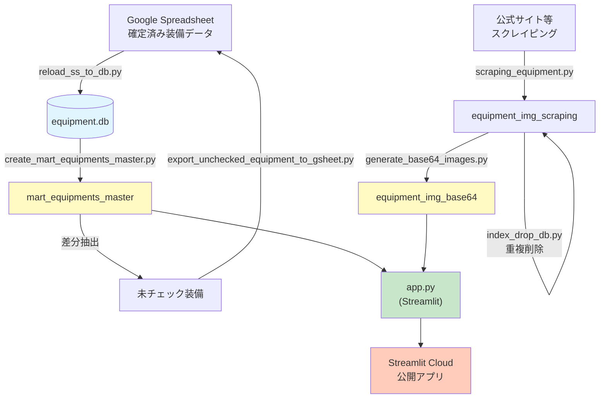

# 龍オン装備検索（Ryuon Equipment Search）

装備の一覧表示・検索・絞り込みのためのツール（Streamlit アプリ）です。  
公開URL： https://apricot-ryuon-equipment.streamlit.app/

---

## 閲覧者向け（使い方）
- 装備一覧の閲覧
- 条件で検索 / フィルタ
- （必要なら）ステータス合算 など

👉 まずは上のURLから利用してください。

---

## 開発者/運用者向け（このリポジトリの役割）
このリポジトリは Streamlit アプリ（上記URL）のバックエンドとして動作します。

- `app.py` は `equipment.db` を参照して表示を行います
- `equipment.db` は **毎日15:00（日本時間）** に更新されます
  - データ元：Google Spreadsheet + スクレイピング
  - 更新は GitHub Actions により自動実行され、更新結果（成功/失敗）は Actions の実行履歴で確認できます

---

## 自動更新（GitHub Actions）
ワークフロー：`.github/workflows/reload-db.yml`

- 実行方法
  - 定期実行：毎日 15:00 JST（cron: 0 6 * * * / UTC）
  - 手動実行：workflow_dispatch

- 処理の流れ（概要）
  1. Sheets → DB 反映（`reload_ss_to_db.py`）
  2. スクレイピング（`scraping_equipment.py`）
  3. 重複装備画像の削除（`index_drop_db.py`）
  4. 画像の BASE64 化（`generate_base64_images.py`）
  5. マスターテーブル作成（`create_mart_equipments_master.py`）
  6. 未チェック装備のエクスポート（`export_unchecked_equipment_to_gsheet.py`）
  7. ログ更新（`update_load_csv.py`）
  8. `equipment.db`、`load_log.csv`、`static/` をコミットして push


## 仕組み（データフロー）

```mermaid
flowchart TB
  Sheets[Google Spreadsheet<br/>確定済み装備データ] -->|reload_ss_to_db.py| DB[(equipment.db)]
  Web[公式サイト等<br/>スクレイピング] -->|scraping_equipment.py| ImgScraping[equipment_img_scraping]
  ImgScraping -->|index_drop_db.py<br/>重複削除| ImgScraping
  ImgScraping -->|generate_base64_images.py| ImgBase64[equipment_img_base64]
  DB -->|create_mart_equipments_master.py| Mart[mart_equipments_master]
  Mart -->|差分抽出| Unchecked[未チェック装備]
  Unchecked -->|export_unchecked_equipment_to_gsheet.py| Sheets
  Mart --> App["app.py<br/>(Streamlit)"]
  ImgBase64 --> App
  App --> Deploy[Streamlit Cloud<br/>公開アプリ]
  
  style DB fill:#e1f5ff
  style Mart fill:#fff9c4
  style ImgBase64 fill:#fff9c4
  style App fill:#c8e6c9
  style Deploy fill:#ffccbc
```

### データフローの説明
1. **Google Sheets → DB**: 確定済み装備データを各テーブル（ur武器、ksr武器等）に反映
2. **スクレイピング**: 公式サイト等から装備情報と画像を取得
3. **重複削除**: スクレイピングデータから重複を除去
4. **BASE64変換**: 画像をBASE64化してequipment_img_base64テーブルに保存
5. **マスター作成**: 全装備データをmart_equipments_masterに統合
6. **未チェック抽出**: マスターとスクレイピングデータの差分を抽出してGoogle Sheetsにエクスポート
7. **アプリ表示**: mart_equipments_masterとequipment_img_base64を結合して表示
---

## 必要な Secrets（GitHub Actions）
以下は **GitHub Actions の Secrets** として設定してください（値は README に書かない）。

| Name | 用途 |
|---|---|
| SPREADSHEET_KEY_NAME | 参照する Google Spreadsheet のキー（識別子） |
| GCP_TYPE | service_account |
| GCP_PROJECT_ID | GCP プロジェクトID |
| GCP_PRIVATE_KEY_ID | サービスアカウント鍵ID |
| GCP_PRIVATE_KEY | サービスアカウント秘密鍵（改行含むので取り扱い注意） |
| GCP_CLIENT_EMAIL | サービスアカウントEmail |
| GCP_CLIENT_ID | サービスアカウントClient ID |
| GCP_AUTH_URI | 認証URI |
| GCP_TOKEN_URI | トークンURI |
| GCP_AUTH_PROVIDER_CERT_URL | 証明書URL |
| GCP_CLIENT_CERT_URL | クライアント証明書URL |
| GCP_UNIVERSE_DOMAIN | googleapis.com など |

補足：
- `NOW_BRANCH` は workflow 実行時のブランチ名が自動で渡されます。

---

## ローカル起動（開発）

### 必要な環境
- Python 3.11（GitHub Actionsと同じバージョン推奨）

### セットアップ
```bash
# Python 3.11で仮想環境を作成
python3.11 -m venv myenv
source myenv/bin/activate  # Windows は myenv\Scripts\activate

# 依存パッケージをインストール
pip install -r requirements.txt

# アプリ起動
streamlit run app.py
```

### その他の実行スクリプト
```bash
# BASE64画像を生成
python generate_base64_images.py

# マスターテーブルを作成
python create_mart_equipments_master.py

# 未チェック装備をエクスポート（環境変数が必要）
python export_unchecked_equipment_to_gsheet.py
```
---
## 主要ファイル

### アプリケーション
- `app.py`：Streamlit アプリ本体（DB参照して表示）
- `equipment.db`：アプリが参照する SQLite DB（Actions で更新）

### データ更新スクリプト
- `reload_ss_to_db.py`：Google Sheets → DB 反映
- `scraping_equipment.py`：装備情報のスクレイピング
- `index_drop_db.py`：重複装備画像の削除・データクレンジング
- `generate_base64_images.py`：画像を BASE64 化して DB 更新
- `create_mart_equipments_master.py`：全装備データを統合したマスターテーブル作成
- `export_unchecked_equipment_to_gsheet.py`：未チェック装備を Google Sheets にエクスポート
- `update_load_csv.py`：更新ログの記録

### その他
- `static/`：装備画像などの静的ファイル
- `migrate_base64_table.py`：BASE64データを別テーブルに移行（初回実行済み）

---

## データベース構造

### 主要テーブル
- `mart_equipments_master`：全装備データの統合マスターテーブル
  - ur武器、ksr武器、ssr武器、ur防具、ksr防具、ssr防具、ur装飾、ksr装飾、ssr装飾
  - non_check_equipments（未チェック装備）
  - これらを統合し、装備種類カラムを付与
  
- `equipment_img_base64`：装備画像のBASE64データ
  - カラム: 装備名、レアリティ、画像名、IMG_URL、BASE64
  - app.pyでの表示に使用

- `equipment_img_scraping`：スクレイピングした装備データ
  - 画像URLやメタデータを保持

- `non_check_equipments`：未確認の装備データ
  - スクレイピングで取得したが、まだ確認されていない装備

- 各レアリティ×装備種類のテーブル（ur武器、ksr武器、ssr武器、ur防具、ksr防具、ssr防具、ur装飾、ksr装飾、ssr装飾）
  - Google Sheets から同期された確定済み装備データ

---
